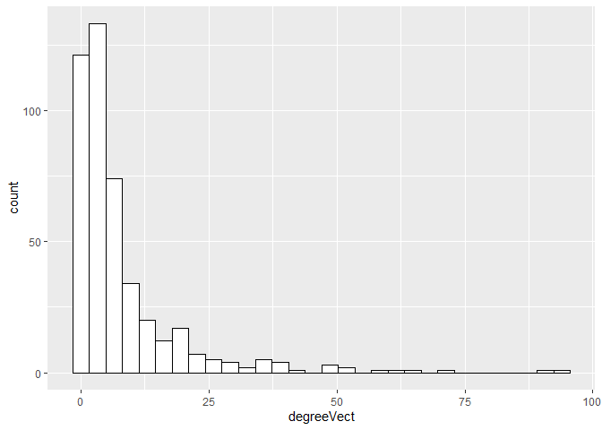
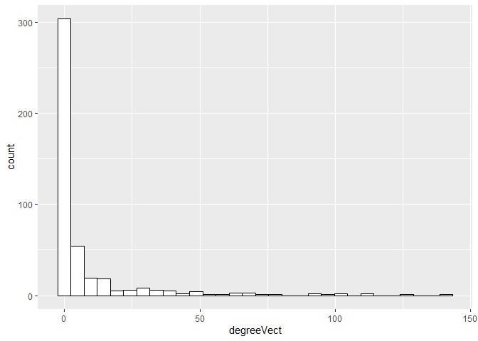
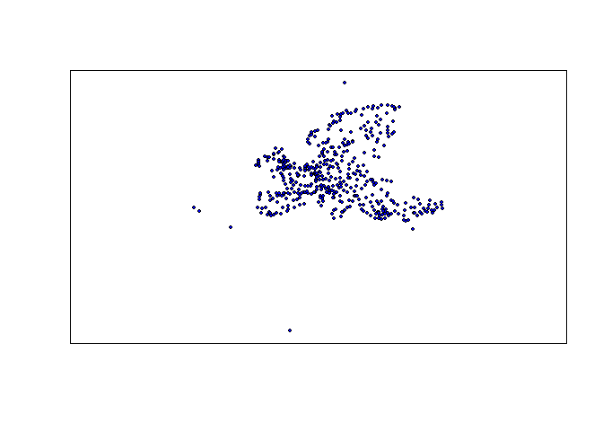
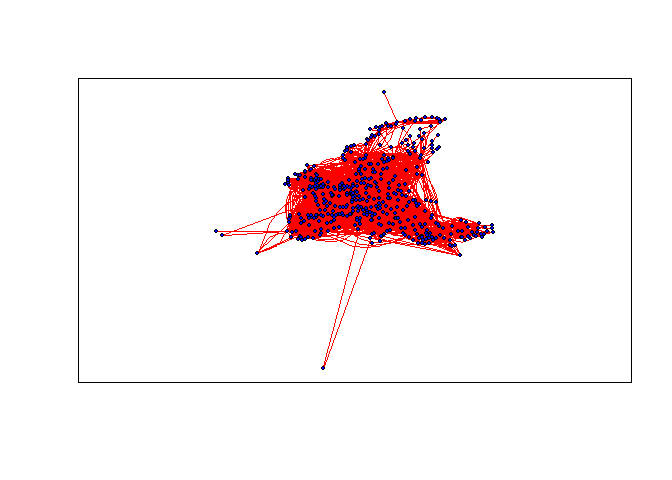

-   [Cel projektu](#cel-projektu)
-   [Informacje o zbiorze danym](#informacje-o-zbiorze-danym)
    -   [Podstawowe informacje na temat
        zbioru](#podstawowe-informacje-na-temat-zbioru)
    -   [Struktura danych](#struktura-danych)
    -   [Informacje na temat sieci](#informacje-na-temat-sieci)
-   [Wizualizacja sieci](#wizualizacja-sieci)
    -   [Wizualizacja lotnisk z
        koordynatami](#wizualizacja-lotnisk-z-koordynatami)
    -   [Wizualizacja połączeń](#wizualizacja-połączeń)
-   [Najbardziej narażone lotniska](#najbardziej-narażone-lotniska)
-   [Strategia zapobiegania dalszym
    infekcjom](#strategia-zapobiegania-dalszym-infekcjom)

Cel projektu
============

Celem niniejszego projektu jest analiza sieci połączeń lotniczych w
Europie, pod kątem potencjalnego rozprzestrzeniania się chorób
zakaźnych. Jak wiadomo, transport lotniczy jest jednym z
najpopularniejszych metod transportu masowego na świecie. Z uwagi na
najmniejszy czas podróży wśród wszystkich innych metod, rozbudowaną sieć
oraz ogromną liczbę pasażerów, transport lotniczy może stanowić poważne
zagrożenie w kontekście transmisji chorób zakaźnych.

Inspiracją niniejszego projektu jest trwająca epidemia koronawirusa
(2019-nCoV), która rozpoczęła się w mieście Wuhan pod koniec 2019 roku.
Projekt ma na celu próbę odpowiedzenia na dwa pytania: które z lotnisk w
Europie są najbardziej narażone na dalsze rozprzestrzenianie
chorobotwórczych patogenów, oraz które lotniska mogą stać się dalszymi
celami, gdy dojdzie już do infekcji na kontynencie.

Informacje o zbiorze danym
==========================

Analizie został poddany zbiór danych “EU-AIR TRANSPORTATION MULTIPLEX”,
dostępny pod adresem
<a href="https://comunelab.fbk.eu/data.php" class="uri">https://comunelab.fbk.eu/data.php</a>.
Zawiera on sieć połączeń pomiędzy lotniskami w Europie. Dodatkowo,
podzielony został na warstwy odpowiadające różnym liniom lotniczym.

Podstawowe informacje na temat zbioru
-------------------------------------

    ## [1] " Liczba wierzchołków (lotnisk):  450"

    ## [1] " Liczba krawędzi (połączeń):  3588"

Struktura danych
----------------

Informacje na temat wierzchołków sieci - zawarte w pliku
“EUAirTransportation\_nodes.txt”. Jest to w zasadzie słownik metadanych,
zawierający nazwy oraz koordynaty lotnisk.

|  nodeID| nodeLabel |   nodeLong|   nodeLat|
|-------:|:----------|----------:|---------:|
|       1| LCLK      |  33.630278|  34.87889|
|       2| EDDF      |   8.570555|  50.03333|
|       3| EDDK      |   7.142779|  50.86583|
|       4| EGNX      |  -1.328055|  52.83111|
|       5| EGTE      |  -3.413888|  50.73444|
|       6| LTBJ      |  27.155001|  38.28917|

Informacje na temat krawędzi sieci - zawarte w pliku
“EUAirTransportation\_multiplex.edges”. Jest to właściwy opis topologii
opisywanej sieci, na podstawie której konstruowany jest graf.

|   V1|   V2|   V3|   V4|
|----:|----:|----:|----:|
|    1|    1|    2|    1|
|    1|    1|   38|    1|
|    1|    2|    7|    1|
|    1|    2|    8|    1|
|    1|    2|   10|    1|
|    1|    2|   14|    1|

Informacje na temat sieci
-------------------------

### Rozkład stopni wejściowych

### Rozkład stopni wyjściowych

### Rozkład długości najkrótszych ścieżek

Przykładowe najkrótsze ścieżki pomiędzy parami wybranych lotnisk

|      |  LTBJ|  LFPG|  LFBO|  EGNT|  EDDP|
|------|-----:|-----:|-----:|-----:|-----:|
| LCLK |     2|     2|     2|     2|     2|
| EDDF |     1|     1|     1|     2|     1|
| EDDK |     1|     1|     2|     2|     1|
| EGNX |     2|     1|     2|     2|     1|
| EGTE |     2|     1|     2|     1|     2|

### Pośrednictwo

    ## [1] 0.3035204

### Lokalny współczynnik gronowania

    ## [1] 0.5054187

### Miary oceny sieci

Gęstość

    ## [1] 0.01775798

Średnia bliskość

    ## [1] 7.653067e-06

Promień

    ## [1] 0

Wizualizacja sieci
==================

Po wczytaniu niezbędnych danych, tworzony jest graf, zawierający w
atrybutach informacje o współrzędnych geograficznych lotnisk. Jest to
istotne przy tworzeniu wizualizacji sieci. Identyfikatory wierzchołków,
pomiędzy którymi znajdują się opisywane w głównym pliku krawędzie, są
mapowane na nazwy, a właściwie skróty określające lotniska. Poniżej
znajduje graficzna reprezentacja sieci.

Wizualizacja lotnisk z koordynatami
-----------------------------------

Wizualizacja połączeń
---------------------

Najbardziej narażone lotniska
=============================

W przypadku wybuchu epidemii, bardzo ważnym działaniem jest zapobieganie
powstawaniu kolejnych ognisk choroby. Jedna chora osoba jest wstanie
zainfekować dziesiątki innych, a dodatkowo, jeżeli odbędzie się to
podczas podroży, może to rozprzestrzenić chorobę pomiędzy różnymi
krajami, a nawet kontynentami. Aby prewencja była skuteczna, warto by
było oszacować najbardziej narażone punkty, w których szansa na
pojawienie się osoby zarażonej jest największa.

W przypadku naszej analizy, jednym z podejść byłoby wyznaczenie lotnisk,
które obsługuje najwięcej różnych połączeń. Takie lotnisko, będąc hubem,
mogłoby obsługiwać zarażonych pasażerów z wielu kierunków. Przyjrzyjmy
się które lotniska spełniają to kryterium - wykorzystamy do tego stopnie
wejściowe wierzchołków. Oto pięć potencjalnie najbardziej narażonych
lotnisk:

| x    |
|:-----|
| EGKK |
| EDDL |
| LIRF |
| EIDW |
| LPPT |

Są to w kolejności lotniska: Londyn-Gatwick, Düsseldorf, Rzym-Fiumicino,
Dublin oraz Lizbona-Portela. Bez wątpienia są to duże porty lotnicze, w
niektórych przypadkach największe w odpowiadających im krajach.

Ta metoda określania zagrożenia nie jest niestety idealna. Faworyzuje
ona lotniska, które mają wiele połączeń wejściowych, ale nie bierze pod
uwagę, czy te połączenia są z portów peryferyjnych, czy innych wielkich
terminali. Lepszą metodą na określenie najbardziej zagrożonych
epidemiologicznie portów lotniczych jest wykorzystanie miary betweenness
centrality. Najbardziej centralne w sieci porty lotnicze, stanowiące
centra przesiadkowe i obsługujące wiele lotów z innych dużych i
popularnych lotnisk, mogą stanowić miejsce największego zagrożenia.

| x    |
|:-----|
| EGKK |
| EDDL |
| EIDW |
| EDDM |
| EVRA |

Analiza pod względem centralności zwróciła podobne, lecz nie jednakowe
wyniki. Najbardziej narażone lotniska to: Londyn-Gatwick, Düsseldorf,
Dublin, Monachium oraz Ryga.

Strategia zapobiegania dalszym infekcjom
========================================

Co jeżeli epidemia dotarła by do Europy? Wystarczyłby jeden pasażer,
obsługiwany na bardziej ruchliwym lotnisku, aby choroba przeniosła się
na różne kraje. Sprawdźmy, z iloma lotniskami ma najbardziej centralny
port lotniczy - Londyn-Gatwick.

    ## + 30/450 vertices, named, from 9f6e781:
    ##  [1] LDDU LDDU LIRP LIRP ESKN LIMJ LPMA LPMA LIPX LIMF LEAM EGPD EGPF EICK EICK
    ## [16] LELC LFMT LFBE EIKN EGAC LXGB LGMK EGNS LCPH EGPE EGPE EGJJ EGJJ EGJB EGHQ

Jak widać powyżej, z samego portu Londyn-Gatwick można dolecieć
bezpośrednio do 30 innych lotnisk. Z uwagi na charakterystykę topologii
sieci połączeń lotniczych, nawet zainfekowanie pasażerów na jednym
lotnisku, może spowodować błyskawiczne rozprzestrzenienie się choroby. W
celu zapobiegania pojawianiu się nowych ognisk choroby, środki
prewencyjne powinny być wdrożone w inny sposób, niż wyłączone kontrola
najbardziej popularnych lotnisk, czy tych mających bezpośrednie
połączenie ze strefą epidemii.
